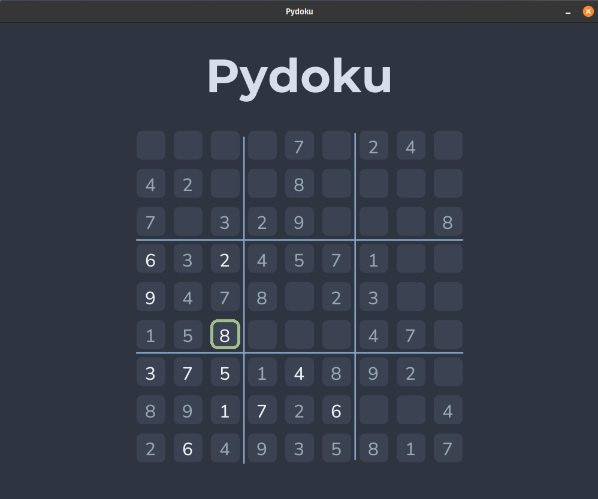

# Pydoku

A simple sudoku game that I made using the popular [pygame](https://pypi.org/project/pygame/) module and the [Sudokum](https://github.com/MorvanZhou/sudoku) module.

#### Video Demo: <https://youtu.be/pP5kWn7wyTw>

## Overview

Upon launch, the app should generate a completely random board of sudoku. The game art/design is completely
custom and hand-made by me. The board renders the default generated numbers in a darker colour so as to make
it less confusing for the player. The app won't allow the player to override the default generated digits on the
board, although, the player may override/erase digits entered by them.
<br>



### How to build

It's best to use a virutal environment of some kind to run this game. The one I used while building the project is `virtualenv`.
Once you have a virtual environment, simply running

```
pip install -r requirements.txt
```

from within the project directory should install all the correct dependencies and you are good to go!<br>

Run the following to launch the game:

```
python main.py
```

## How to play

I have tried to keep it simple in terms of game mechanics:

- Navigate the board using the arrow keys
- If you are a hardcore gamer, you can also use the WASD keys.
- To enter a number at any location, simply navigate to that location, and enter a number.
- If you wish to change the number you entered, enter the new number whilst on the same location on the board.
- In order to erase/remove an entered number, go to it and enter 0 (zero) or press Backspace. Whichever you prefer(The 0 key to remove a digit makes it easier to do so, when you are using the numpad on your keyboard).
- If you fill in all the digits correctly on the board, the game should prompt you with a "WIN" screen. Whilst on this screen, if you wish to play again, simply press ENTER as prompted by the screen.
- If however, the digits you filled in on the board are
  not all correctly placed, the game won't prompt you and you will need to place them properly in order to complete the game.

That's all! Have fun!

## Under the Hood

As already mentioned, the game uses pygame to do all the rendering and the sudokum module to generate the board.
Learning the fundamentals of pygame was an easy enough task. 5 hours of following a 2 hour tutorial, and voila! you're done!
The board generation was easily done using the sudokum module, but the function to check the board had some issues in the said library. The one implemented in this project has been tweaked by me in order to work with any given input board (of size 9\*9) as the original function only returned the correct answer if the board was completely filled out, otherwise the returned value was unreliable. The improved version of this check function can be found in the `check_function.py` file under the project directory.

- The `main.py` file contains the actual driver code for the game.
- The `render_utils.py` file contains all the functions that were created to allow easy rendering of the main game elements onto the screen.
- All the game design files and the images used in-game are stored in the `Art/` directory.
- The `Fonts/` directory, as the name suggests, contains the fonts used.
- If, for whatever reason, you wish to change the difficulty of the game, you can change the value of the `DIFFICULTY` variable within the main.py file to suit your needs. Accepted values are between 0 and 1.

### End note

I am truly thankful to the CS50 team for delivering such high quality content for free to the entire world. This course has provided me with strong fundamental understanding of computer science, which I would have to otherwise scour tutorials and join bits and pieces to acquire.
Thank You!
